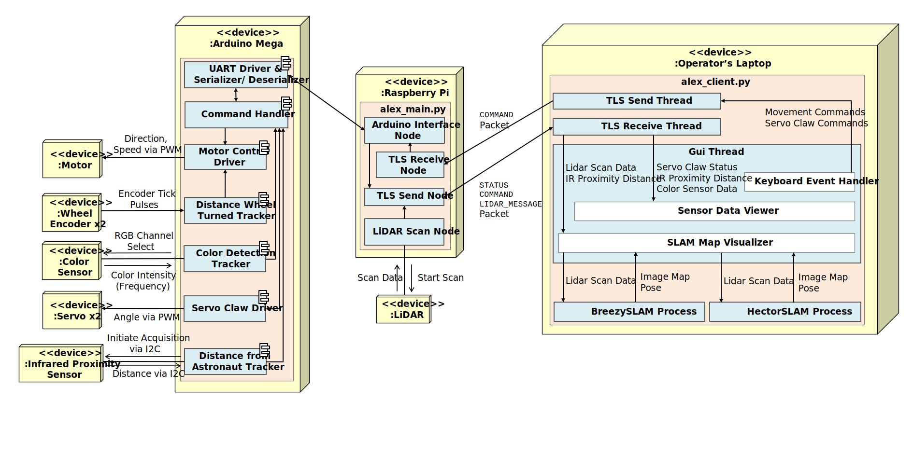

A Qt-based interface for real-time robot control over TLS, with LiDAR SLAM processing running in parallel via Python multiprocessing.
 
### Architecture Overview

The GUI which runs in a Ubuntu environment on the operator’s laptop provides a unified interface to monitor and control the robot. A TLS client is used to wirelessly exchange data with the Raspberry Pi located on the robot, and in turn the Arduino.

### SLAM without Odometry (BreezySlam & HectorSlam)
The [BreezySlam](https://github.com/simondlevy/BreezySLAM) python package was primarily used as it is capable of performing SLAM mapping without any odometry (lack of odometry was due to the hardware limitation of the robot). Additionally, [HectorSlam](https://github.com/tu-darmstadt-ros-pkg/hector_slam/) was also evaluated. However, as HectorSlam is coupled with ROS, much work was needed to decouple it from ROS. Once making it standalone, python bindings were then written to the C++ API using [pybind11](https://github.com/pybind/pybind11). The 2D point data from the LiDAR was fed then in parallel to separate processes to ensure continuous mapping even if one algorithm encountered errors. In testing, both algorithms did not fare so well when the robot rotated too quickly. BreezySlam was less susceptible to corruption but produces blurrier maps than HectorSlam in our experience. In retrospect, odometry would have really helped. 