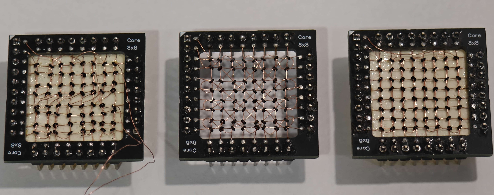

In this article, I’ll share how I designed and built a 512-bit magnetic core memory system that runs at 250kHz. Through careful tuning of drive currents, several gigabytes of test data has been successfully read/written without a single error.

## Introduction
Magnetic core memory was the primary random-access memory (RAM) technology from the 1950s-1970s, used in everything from calculators to supercomputers. Uniquely, it was non-volatile too, allowing computers to resume operation even after a power loss. Recently, there has been a resurgence in interest in this retro computing technology.

### Writing

It turns out that if sufficient current is passed through a ferrite core, it can be magnetised in a certain direction. This magnetism can be retained even after the current has been turned off, allowing it to store a single bit of data.

This behaviour can be demonstrated by the hysteresis curve (B-H curve) in the above figure. Let's suppose the core is unmagnetized at the start (point P), applying a sufficient current in the wire will generate a magnetic field \(\mathrm{H_{sat}}\) and thus we will reach point Q. Once the current is removed, the magnetic flux from the core settles at point R. We can arbitrarily define this state as a 'zero'\. Next, applying a sufficient current opposite to the previous direction in the wire will generate a magnetic field \(\mathrm{-H_{sat}}\) and thus we will reach point S. Once the current is removed, the magnetic flux from the core settles at point T. The core has now flipped from 'zero' to 'one'.

### Reading
How can a core flip be detected? Well, an additional wire (called the sense wire) is wired through the core. When the core flips from one state to another, its quickly changing magnetic flux B will cause a detectable voltage pulse to appear across the sense wire. The polarity of the voltage pulse does not matter as we will use a sense detector that is sensitive to both positive and negative pulses.

In the above figure, a test waveform of the sequence write 'zero', then write 'zero', then write 'one', then write 'one' is shown.

A read operation is done by writing a 'zero'. If the core was previously in a 'one' state, the core will flip to the 'zero' state and thus generate a large pulse on the sense wire. If the core was previously in a 'zero' state, minimal voltage is generated. As you noticed, the read operation is destructive, so a 'one' may have to be written afterwards to restore the value.

### Scaling Up: 2D Addressing
So far we have a single core. To scale up to \(n\) number of bits, once may naively construct \(n\) times more current driving units. A more practical solution is to arrange the cores in a 2D matrix. This way the number of current driving units scales by \(\sqrt n\). 

Instead of a single drive wire and a sense wire, we duplicate the drive wire. So now we have 3 wires: the X drive, Y drive and the sense wire.

At each core, the vector sum of X and Y drive currents give the net current.

## Teething Problems
### Sensitivity of Current
We have established that a half select current should not have any effect on a core, while a full select current should be sufficient to flip a core. To determine which value of current is optimal for the core memory, we can vary the current limiting resistors of the drivers or the voltage. The optimal current depends on material composition, size and temperature of the core. Moreover, there could even be slight differences between similar cores.

#### Experiment 1: Full Select Current Switching Test
In our first experiment, a full select current is sent in one direction, thereafter, a full select current is sent in the other direction.

In the above figure, we see that a larger full select current increases the amplitude of the sense wire voltage, and ensures that the core completely flips.

#### Experiment 2: Half Select Current Switching Test
In our second experiment, a full select current is sent in one direction (lets say 'zero'). Next, a half select current is sent in other direction ('one') 1024 times. Finally, a full select current is sent the original direction ('zero'). This experiment tests whether repeated half select current disturbs the original state.

In the above figure, only the sense wire voltage during the final full select current has been captured to space. When half select current is too large (360mA), the core slowly goes to the 'one' state. Hence, when the final full select current is sent to write a 'zero', the change from 'one' to 'zero' state causes a pulse to be seen. This is problematic, as reading or writing to a particular core could cause other cores in the matrix to flip even when we don't want to.

As described, there is a narrow sweet spot (within a few %) where the core memory works reliably. In my opinion, this is somewhat disappointing, as I thought it would be less finicky. Nevertheless, core memory when designed well has proven itself to be very reliable.

## Scaling Up Even More!
### Sense Wire Arrangements
The way the sense wire is threaded through the cores greatly affects the measured signal. In general, the aim is too reduce noise pickup by making sure induced voltages from the wires cancel out as much as possible.

I have threaded the sense wires in 3 different arrangements to demonstrate the effect. In my experiment, I send a full current pulse in one direction at approximately 0us and 2us. Next, I send a full current pulse both in the opposite direction at approximately 4us and 6us.

Both the "Optimized Rectangular" and "Diagonal" sense arrangements showed very clear spikes at 0us and 4us which correspond to a core flip. While the same spikes were observed for the "Unoptimized Rectangular" arrangement, coupled noise also generates unwanted spikes which make it difficult to differentiate a core flip.

#### "4 Wire System", an extra wire for Inhibit

#### "3 Wire System", using the Sense Wire as Inhibit
Instead of threading 4 wires through each core, it turns out we can use the sense wire as a inhibit line in a clever manner. The "Optimized Rectangular" arrangement.

## Making Your Own Core Memory System
### Weaving Your Core Memory Module
The memory module is completely hand assembled from 1.3mm diameter ferrite cores I obtained. 

### The Driver Board
For your reference, the complete PCB design files are provided as is. Your results may vary; modification of resistor values for the current limiting and sense detector may be required.

## Further Reading
If you wish to explore in much more detail, here are some useful resources I found on the web:
1. Jones, J. R. (1976, July). *Coincident current ferrite core memories.* Byte Magazine. Retrieved from https://ed-thelen.org/comp-hist/Byte/76jul.html
2. Naval Education and Training Command. (1978). *Digital computer basics (NAVEDTRA 10088-B, Rev. ed.).* United States Government Printing Office. Retrieved from https://www.ed-thelen.org/comp-hist/navy-core-memory-desc.html
3. Wayne’s Tinkering Page. (n.d.). *One bit ferrite core memory.* Retrieved from https://sites.google.com/site/wayneholder/one-bit-ferrite-core-memory
4. Sala, M. A. (1977, September). *Core memories: How they work.* Radio-Electronics Magazine. Retrieved from http://www.decodesystems.com/re-core-memories.html
5. Madrona.ca. (2003, December). *Magnetic core memory systems.* Retrieved from http://madrona.ca/e/coremem/index.html
6. Jones, D. W. (n.d.). *Doug Jones's Core Memory Index.* The University of Iowa, Department of Computer Science. Retrieved from https://homepage.cs.uiowa.edu/~jones/core/
7. IBM Corporation. (1967, June). *IBM Field Engineering Theory of Operation, Processing Unit System/360 Model 30  (Publication No. Y24-3360-0)*. Retrieved from https://bitsavers.org/pdf/ibm/360/fe/2030/Y24-3360-1_2030_FE_Theory_Opns_Jun67.pdf
8. McBride, J. (n.d.). *Core memory part 1: Ferrite comparison*. Retrieved from https://jeffmcbride.net/core-memory/single-bit/
9. Jarvin, S. D. (1965). *Ferrite core memory (Master’s thesis, University of Alberta, Department of Electrical Engineering).* Retrieved from https://archive.org/details/Jarvin1965/
10. Bates, R. M. (1968). *Coincident current magnetic core memories (Master’s thesis, Kansas State University, Department of Electrical Engineering).* Retrieved from https://krex.k-state.edu/server/api/core/bitstreams/11218bbb-d8b1-4875-a666-de67c7e94f1d/content
11. Freeman, J. R. (1954, September). *Pulse responses of ferrite memory cores (Memorandum M-268-1). Massachusetts Institute of Technology.* Retrieved from http://www.bitsavers.org/pdf/mit/whirlwind/M-series/M-2568-1_Pulse_Responses_of_Ferrite_Memory_Cores_Sep54.pdf
12. F-J's Physics. (2023, December). *Magnetic core memory explained (Part 1) [Video]*. YouTube. Retrieved from https://www.youtube.com/watch?v=T8VreNzldWc