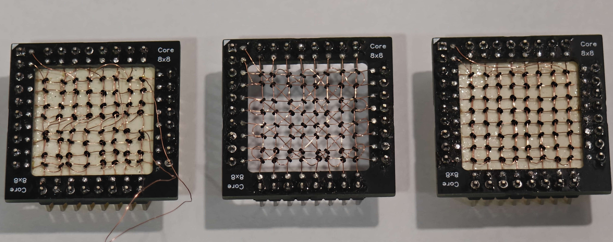
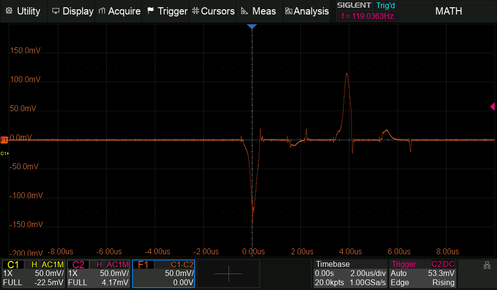
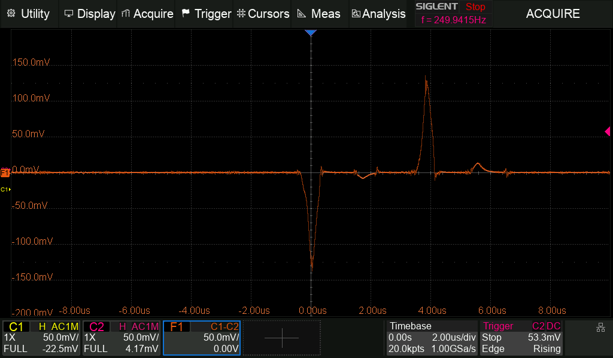
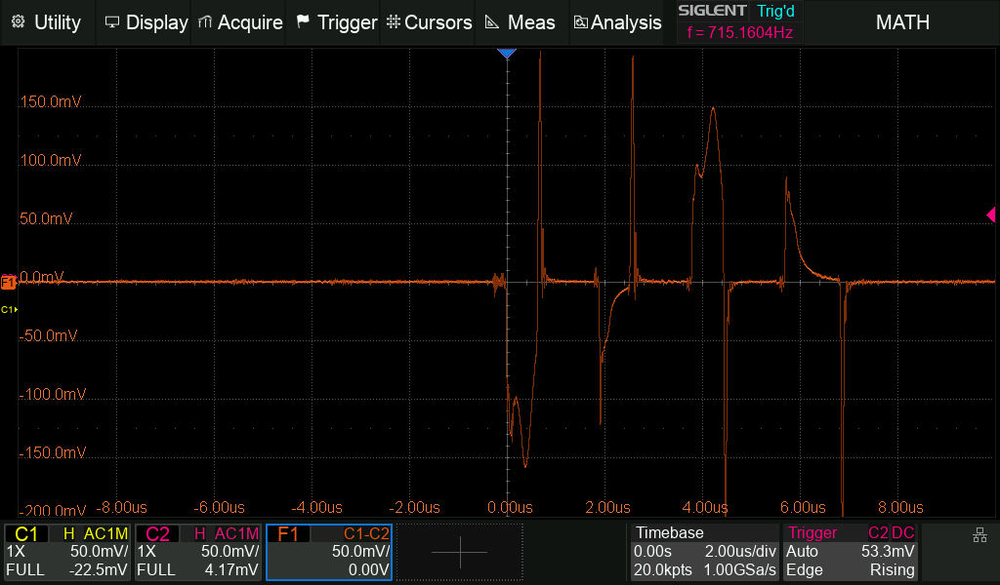

I wanted to make the toggle theme icon change from 'moon' to 'sun' depending on whether dark or light mode is active.

A possible solution would be to use Javascript to add/remove the classes for the icons once when the website loads and when the theme changes. However, instead of adding extra javascript logic to handle the specific icon, a more elegant approach is to use CSS.

### Sense Wire Arrangements
The way the sense wire is threaded through the cores greatly affects the measured signal. In general, the aim is too reduce noise pickup by making sure induced voltages cancel out as much as possible [^1]



I have threaded the sense wires in 3 different arrangements to demonstrate the effect. In my experiment, I send a full current pulse in one direction at approximately 0us and 2us. Next, I send a full current pulse both the in the opposite direction at approximately 4us and 6us.




Both the "Optimized Rectangular" and "Diagonal" sense arrangements showed very clear spikes at 0us and 4us which correspond to a core flip. While the same spikes were observed for the "Unoptimized Rectangular" arrangement, coupled noise also generate unwanted spikes which make it difficult to differentiate a core flip.

### "4 Wire System", an extra wire for Inhibit

### "3 Wire System", using the Sense Wire as Inhibit
Instead of threading 4 wires through each core, it turns out we can use the sense wire as a inhibit line in a clever manner. The "Optimized Rectangular" arrangement.

[^1]: Footnote
https://ed-thelen.org/comp-hist/Byte/76jul.html
>sidebar.html
>```html
><button type="button" class="btn btn-link nav-link" aria-label="Switch Mode" id="mode-toggle">
>   <i class="fas fa-sun hide-when-dark"></i>
>   <i class="fas fa-moon hide-when-light"></i>
></button>
>```