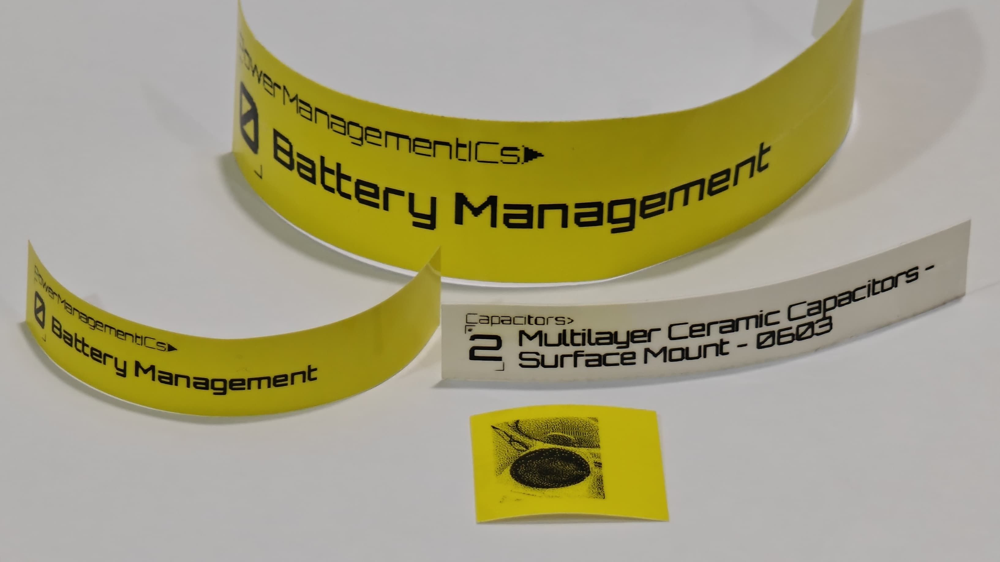
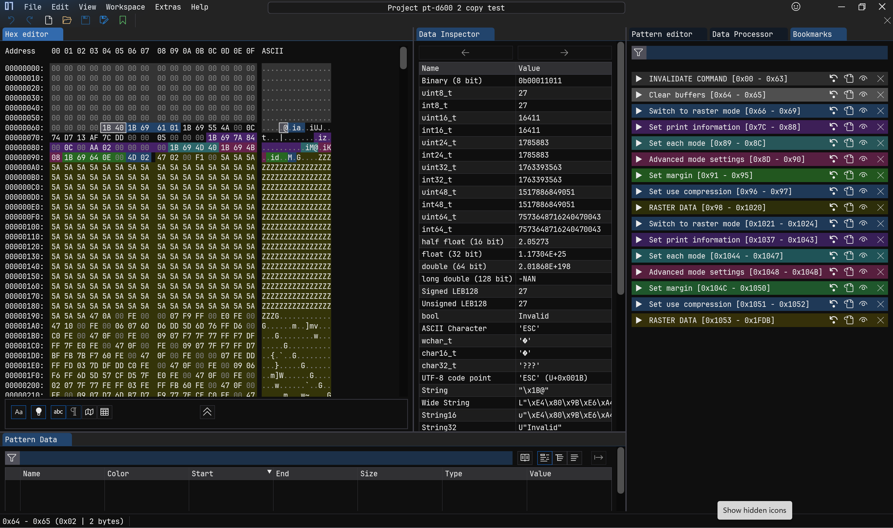

An Android application for USB printing with the Brother PT-D600 label printer.
[Project Source Code](https://github.com/HX2003/LabelPrinter)

## Features
### Image Manipulation
- Crop, rotate or flip images
- Dither images, or use a threshold to convert the image to B/W
- Print preview
### Printer Status Integration
- Automatically detect the size of label
- Multiple copies support (reducing paper usage)
- Printing progress & error detection

 
<video src="LabelPrinterDemoVideo.mp4" controls></video>
 

## Technical Details
This project is built using the native [Jetpack Compose](https://developer.android.com/compose) framework for Android with [Material Design 3](https://developer.android.com/develop/ui/compose/designsystems/material3) UI components.

### Architecture Overview

### USB Protocol
Documentation is readily available for similar models in the same family as the PT-D600 label printer. Thankfully, there are only minimal differences in the protocol between the models. To further verify this, the data packets sent using the official drivers were captured and analyzed using a Hex Editor like ImHex Editor (which I highly recommend).
