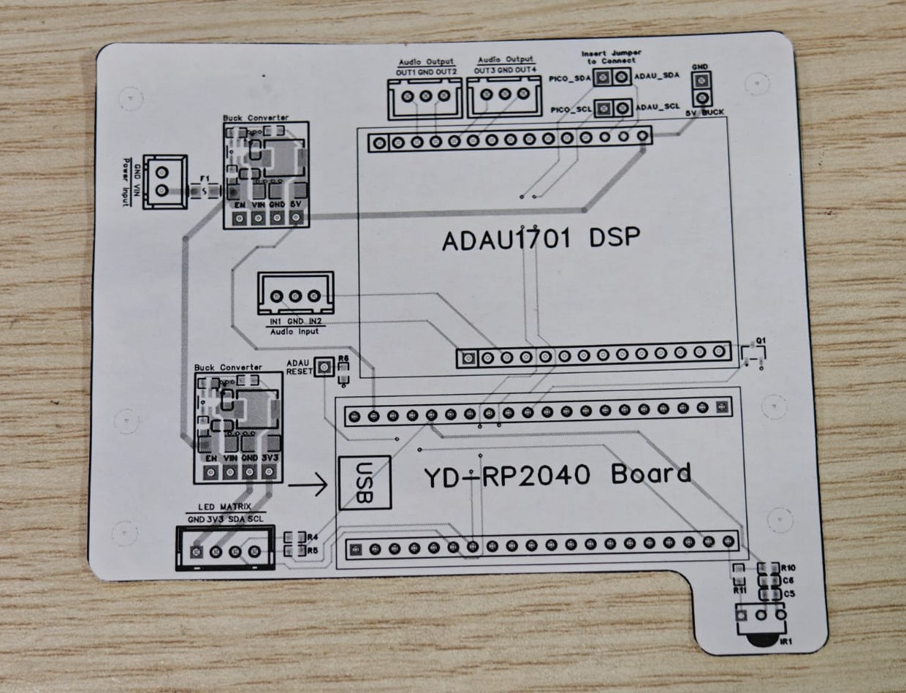

A 4-channel audio amplifier system featuring a ADAU1701 DSP, with DSP firmware and audio parameters configured via I²C from the main RP2040 microcontroller. The device is controlled via infrared, and has a custom 8 character 14-segment display.
[Project Source Code](https://github.com/HX2003/RP2040AudioAmplifierDSP)

